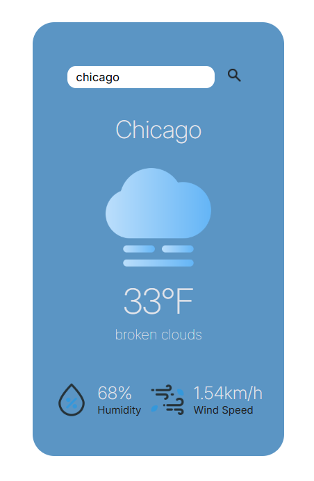

# 🌤️ Weather App *Learning Based 

> I designed and developed a simple weather web application using React.js, Node.js, and Express.js. This application was a learning based project to help me practice fetching real-time data dynamically from OpenWeatherAPI using a frontend and backend framework.
> The design was made using Figma.

  

## 🚀 Video Demo  
🔗 [View Project Video](https://app.screencastify.com/v3/watch/Q3EO49pnQQXPrlwu8z5v)

---

## 📌 Features  
✅ Real-time weather data (temperature, humidity, wind speed)

✅ Fetch data from a Node.js/Express backend 

✅ Frontend built with React.js

✅ Uses Axios to make HTTP requests to the backend 

✅ Images dynamically change based off the description of the weather

✅ Clean Design  

---

## 🛠️ Technologies Used  
- React.js  
- CSS
- Node.js
- Express.js
- Axios 
- Figma  

---

## 📈 Future Improvements  
🔹 Present more data  
🔹 Deployment

---

## 📄 Credits  
🎨 Icons used in this project are from [Flaticon](https://www.flaticon.com/) by [apien](https://www.flaticon.com/authors/apien).

💻 **Developed by:** [Me](https://github.com/lexp2204)  

---

## 🌟 Show Your Support  
⭐ If you like this project, **give it a star** on GitHub!  
